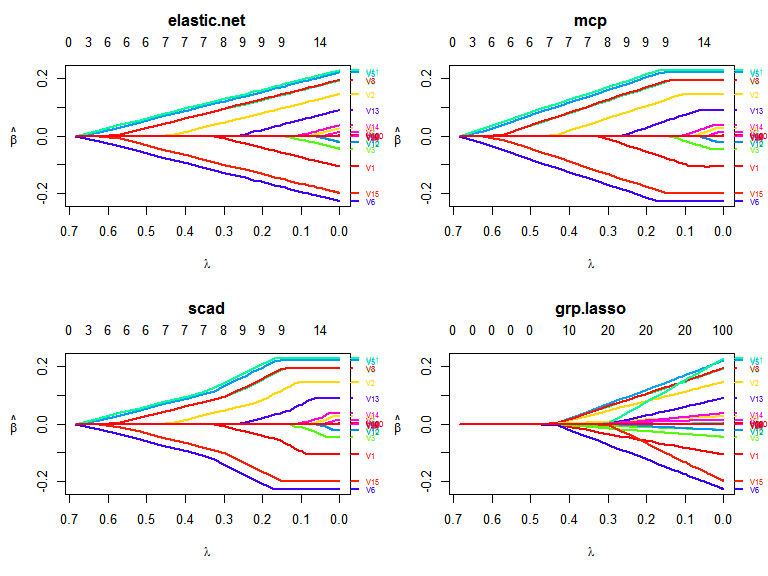

## Introduction

The oem package provides estimaton for various penalized linear models using the [Orthogonalizing EM algorithm](http://amstat.tandfonline.com/doi/abs/10.1080/00401706.2015.1054436). 

Install using the **devtools** package:

```r
#devtools::install_github("jaredhuling/oem")
```

or by cloning and building using `R CMD INSTALL`

## Models

### Lasso


```r
library(microbenchmark)
library(glmnet)
library(oem)
# compute the full solution path, n > p
set.seed(123)
n <- 1000000
p <- 100
m <- 25
b <- matrix(c(runif(m), rep(0, p - m)))
x <- matrix(rnorm(n * p, sd = 3), n, p)
y <- drop(x %*% b) + rnorm(n)

lambdas = oem(x, y, intercept = TRUE, standardize = FALSE)$lambda

microbenchmark(
    "glmnet[lasso]" = {res1 <- glmnet(x, y, thresh = 1e-10, 
                                      standardize = FALSE,
                                      intercept = TRUE,
                                      lambda = lambdas)}, 
    "oem[lasso]"    = {res2 <- oem(x, y,
                                   penalty = "elastic.net",
                                   intercept = TRUE, 
                                   standardize = FALSE,
                                   lambda = lambdas,
                                   tol = 1e-10)},
    times = 5
)
```

```
## Unit: seconds
##           expr      min       lq     mean   median       uq      max neval
##  glmnet[lasso] 6.120663 6.279004 6.714391 6.377707 6.687404 8.107179     5
##     oem[lasso] 1.657363 1.660466 1.710677 1.668186 1.759040 1.808331     5
##  cld
##    b
##   a
```

```r
# difference of results
max(abs(coef(res1) - res2$beta[[1]]))
```

```
## [1] 1.048072e-07
```

```r
res1 <- glmnet(x, y, thresh = 1e-12, # thresh must be very low for glmnet to be accurate
                                      standardize = FALSE,
                                      intercept = TRUE,
                                      lambda = lambdas)

max(abs(coef(res1) - res2$beta[[1]]))
```

```
## [1] 3.763398e-09
```

### Nonconvex Penalties


```r
library(sparsenet)
library(ncvreg)
library(plus)
# compute the full solution path, n > p
set.seed(123)
n <- 5000
p <- 200
m <- 25
b <- matrix(c(runif(m, -0.5, 0.5), rep(0, p - m)))
x <- matrix(rnorm(n * p, sd = 3), n, p)
y <- drop(x %*% b) + rnorm(n)

mcp.lam <- oem(x, y, penalty = "mcp",
               gamma = 2, intercept = TRUE, 
               standardize = TRUE,
               nlambda = 200, tol = 1e-10)$lambda

scad.lam <- oem(x, y, penalty = "scad",
               gamma = 4, intercept = TRUE, 
               standardize = TRUE,
               nlambda = 200, tol = 1e-10)$lambda

microbenchmark(
    "sparsenet[mcp]" = {res1 <- sparsenet(x, y, thresh = 1e-10, 
                                          gamma = c(2,3), #sparsenet throws an error 
                                                          #if you only fit 1 value of gamma
                                          nlambda = 200)},
    "oem[mcp]"    = {res2 <- oem(x, y,  
                                 penalty = "mcp",
                                 gamma = 2,
                                 intercept = TRUE, 
                                 standardize = TRUE,
                                 nlambda = 200,
                                 tol = 1e-10)},
    "ncvreg[mcp]"    = {res3 <- ncvreg(x, y,  
                                   penalty = "MCP",
                                   gamma = 2,
                                   lambda = mcp.lam,
                                   eps = 1e-7)}, 
    "plus[mcp]"    = {res4 <- plus(x, y,  
                                   method = "mc+",
                                   gamma = 2,
                                   lam = mcp.lam)},
    "oem[scad]"    = {res5 <- oem(x, y,  
                                 penalty = "scad",
                                 gamma = 4,
                                 intercept = TRUE, 
                                 standardize = TRUE,
                                 nlambda = 200,
                                 tol = 1e-10)},
    "ncvreg[scad]"    = {res6 <- ncvreg(x, y,  
                                   penalty = "SCAD",
                                   gamma = 4,
                                   lambda = scad.lam,
                                   eps = 1e-7)}, 
    "plus[scad]"    = {res7 <- plus(x, y,  
                                   method = "scad",
                                   gamma = 4,
                                   lam = scad.lam)}, 
    times = 5
)
```


```
## Unit: milliseconds
##            expr       min        lq      mean    median        uq
##  sparsenet[mcp] 1448.8164 1451.6876 1478.8002 1488.3527 1498.0732
##        oem[mcp]  132.6248  134.7694  149.0780  136.5938  144.7275
##     ncvreg[mcp] 7127.0569 7304.4706 7676.7189 7430.6113 7965.2079
##       plus[mcp] 1542.6019 1620.2429 1687.8928 1665.5308 1740.6475
##       oem[scad]  105.9462  107.9688  109.7419  108.0584  109.2852
##    ncvreg[scad] 7373.2260 7420.2782 7887.8272 7550.5781 7695.6972
##      plus[scad] 1708.9508 1733.6277 1785.0805 1742.6069 1785.8090
##        max neval cld
##  1507.0713     5  b 
##   196.6747     5 a  
##  8556.2479     5   c
##  1870.4410     5  b 
##   117.4509     5 a  
##  9399.3563     5   c
##  1954.4082     5  b
```

```r
diffs <- array(NA, dim = c(4, 1))
colnames(diffs) <- "abs diff"
rownames(diffs) <- c("MCP:  oem and ncvreg", "SCAD: oem and ncvreg",
                     "MCP:  oem and plus", "SCAD: oem and plus")
diffs[,1] <- c(max(abs(res2$beta[[1]] - res3$beta)), max(abs(res5$beta[[1]] - res6$beta)),
               max(abs(res2$beta[[1]][-1,1:nrow(res4$beta)] - t(res4$beta))),
               max(abs(res5$beta[[1]][-1,1:nrow(res7$beta)] - t(res7$beta))))
diffs
```

```
##                          abs diff
## MCP:  oem and ncvreg 5.149270e-10
## SCAD: oem and ncvreg 2.089842e-10
## MCP:  oem and plus   2.268799e-11
## SCAD: oem and plus   1.426526e-11
```


### Fitting Multiple Penalties

The oem algorithm is quite efficient at fitting multiple penalties simultaneously when $p$ is not too big.


```r
set.seed(123)
n <- 100000
p <- 100
m <- 15
b <- matrix(c(runif(m, -0.25, 0.25), rep(0, p - m)))
x <- matrix(rnorm(n * p, sd = 3), n, p)
y <- drop(x %*% b) + rnorm(n)

microbenchmark(
    "oem[lasso]"    = {res1 <- oem(x, y,
                                   penalty = "elastic.net",
                                   intercept = TRUE, 
                                   standardize = TRUE,
                                   tol = 1e-10)},
    "oem[lasso/mcp/scad/ols]"    = {res2 <- oem(x, y,
                                   penalty = c("elastic.net", "mcp", "scad", "ols"),
                                   gamma = 4,
                                   intercept = TRUE, 
                                   standardize = TRUE,
                                   tol = 1e-10)},
    times = 5
)
```

```
## Unit: milliseconds
##                     expr      min       lq     mean   median       uq
##               oem[lasso] 195.2687 195.4972 205.9907 198.2181 211.2017
##  oem[lasso/mcp/scad/ols] 200.9957 205.7040 209.5185 206.4619 206.8625
##       max neval cld
##  229.7679     5   a
##  227.5685     5   a
```

```r
layout(matrix(c(1,2,3), ncol=3, byrow = TRUE))
plot(res2, which.model = 1, main = "lasso")
plot(res2, which.model = 2, main = "mcp")
plot(res2, which.model = 3, main = "scad")
```

 
